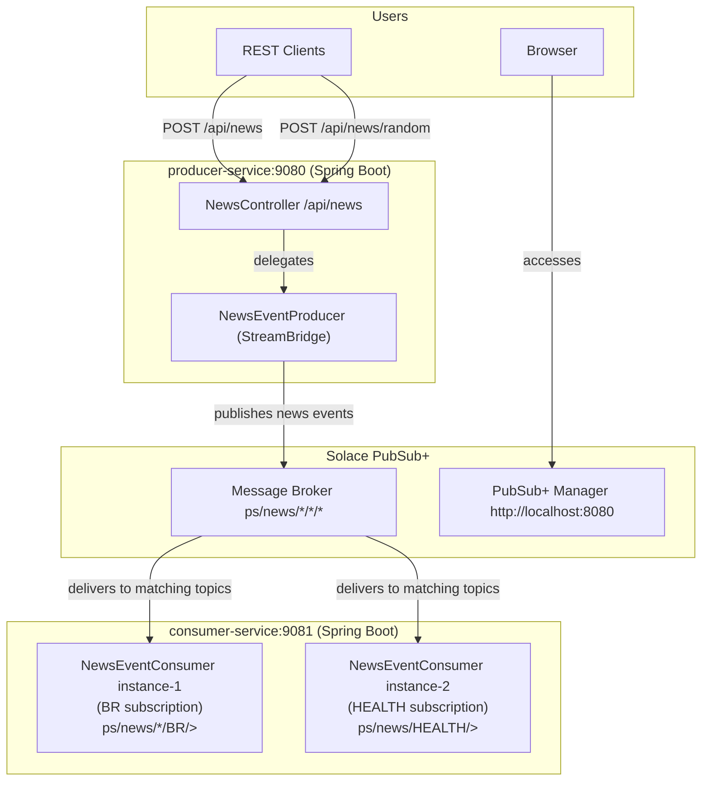

# spring-cloud-stream-solace-pubsub

[](LICENSE)
[](https://buymeacoffee.com/ivan.franchin)

A publish/subscribe demo using [Solace PubSub+](https://www.solace.dev/) and [Spring Cloud Stream](https://spring.io/projects/spring-cloud-stream). A REST API publishes news events to topic `ps/news/{type}/{country}/{city}`, with consumer instances filtering by news type, country or city to showcase topic-based routing.

## Proof-of-Concepts & Articles

On [ivangfr.github.io](https://ivangfr.github.io), I have compiled my Proof-of-Concepts (PoCs) and articles. You can easily search for the technology you are interested in by using the filter. Who knows, perhaps I have already implemented a PoC or written an article about what you are looking for.

## Additional Readings

- \[**Medium**\] [**Solace PubSub+ vs Kafka: Different Approaches to Topic Routing**](https://medium.com/@ivangfr/solace-pubsub-vs-kafka-different-approaches-to-topic-routing-593374ef02ee)
- \[**Medium**\] [**Solace PubSub+ and Spring Boot: Implementing News Producer and Consumer Apps**](https://medium.com/@ivangfr/solace-pubsub-and-spring-boot-implementing-news-producer-and-consumer-apps-1f80cb3fed43)
- \[**Medium**\] [**Solace PubSub+ and Spring Boot: Implementing Unit Tests for News Producer and Consumer Apps**](https://medium.com/@ivangfr/solace-pubsub-and-spring-boot-implementing-unit-tests-for-news-producer-and-consumer-apps-6c1b8257f7a0)
- \[**Medium**\] [**Solace PubSub+ and Spring Boot: Implementing End-to-End Tests for News Producer and Consumer Apps**](https://medium.com/@ivangfr/solace-pubsub-and-spring-boot-implementing-end-to-end-tests-for-news-producer-and-consumer-apps-353e5b3843f4)
- \[**Medium**\] [**Solace PubSub+ and Spring Boot: Running News Producer and Consumer Apps in Minikube (Kubernetes)**](https://medium.com/@ivangfr/solace-pubsub-and-spring-boot-running-news-producer-and-consumer-apps-in-minikube-kubernetes-b9fb167a5bbc)

## Project Overview



## Applications

- ### producer-service

  [`Spring Boot`](https://docs.spring.io/spring-boot/index.html) application that exposes a REST API to submit `news` events. It publishes news to the following destination with the format: `ps/news/{type}/{country}/{city}`

  Endpoints
  ```text
  POST /api/news {"type": [SPORT|ECONOMY|HEALTH], "country": "...", "city": "...", "title": "..."}
  POST /api/news/random {"number": ..., "delay": ...}
  ```

- ### consumer-service

  `Spring Boot` application that consumes the `news` events published by `producer-service`.

## Prerequisites

- [`Java 25`](https://www.oracle.com/java/technologies/downloads/#java25) or higher.
- A containerization tool (e.g., [`Docker`](https://www.docker.com), [`Podman`](https://podman.io), etc.)

## Start Environment

Open a terminal and inside the `spring-cloud-stream-solace-pubsub` root folder run:
```bash
docker compose up -d
```

## Running Applications with Maven

  - **producer-service**

    - In a terminal, make sure you are in the `spring-cloud-stream-solace-pubsub` root folder.
    - Run the commands below:
      ```bash
      ./mvnw clean spring-boot:run --projects producer-service
      ```

  - **consumer-service-1**

    - It subscribes to all news from `Brazil`.
    - Open a new terminal and navigate to the `spring-cloud-stream-solace-pubsub` root folder.
    - Run the commands below:
      ```bash
      export NEWS_SUBSCRIPTION="ps/news/*/BR/>"
      ./mvnw clean spring-boot:run --projects consumer-service
      ```

  - **consumer-service-2** 

    - It subscribes to all news related to `HEALTH`.
    - Open a new terminal and navigate to the `spring-cloud-stream-solace-pubsub` root folder.
    - Run the commands below:
      ```bash
      export SERVER_PORT=9082
      export NEWS_SUBSCRIPTION="ps/news/HEALTH/>"
      ./mvnw spring-boot:run --projects consumer-service
      ```

## Running Applications as Docker containers

- ### Build Docker Images

  - In a terminal, make sure you are inside the `spring-cloud-stream-solace-pubsub` root folder.
  - Run the following script to build the Docker images:
    ```bash
    ./build-docker-images.sh
    ```

- ### Environment Variables

  - **producer-service**

    | Environment Variable | Description                                                                      |
    |----------------------|----------------------------------------------------------------------------------|
    | `SOLACE_HOST`        | Specify host of the `Solace PubSub+` message broker to use (default `localhost`) |
    | `SOLACE_PORT`        | Specify port of the `Solace PubSub+` message broker to use (default `55556`)     |

  - **consumer-service**

    | Environment Variable | Description                                                                      |
    |----------------------|----------------------------------------------------------------------------------|
    | `SOLACE_HOST`        | Specify host of the `Solace PubSub+` message broker to use (default `localhost`) |
    | `SOLACE_PORT`        | Specify port of the `Solace PubSub+` message broker to use (default `55556`)     |

- ### Run Docker Containers

  - **producer-service**

    Run the following command in a terminal:
    ```bash
    docker run --rm --name producer-service \
      -p 9080:9080 \
      -e SOLACE_HOST=solace -e SOLACE_PORT=55555 \
      --network=spring-cloud-stream-solace-pubsub_default \
      ivanfranchin/producer-service:1.0.0
    ```

  - **consumer-service-1**

    - It subscribes to all news from `Brazil`.
    - Open a new terminal and run the following command:
      ```bash
      docker run --rm --name consumer-service-1 \
        -p 9081:9081 \
        -e SOLACE_HOST=solace -e SOLACE_PORT=55555 \
        -e NEWS_SUBSCRIPTION="ps/news/*/BR/>" \
        --network=spring-cloud-stream-solace-pubsub_default \
        ivanfranchin/consumer-service:1.0.0
      ```

  - **consumer-service-2**

    - It subscribes to all news related to `HEALTH`.
    - Open a new terminal and run the following command:
      ```bash
      docker run --rm --name consumer-service-2 \
        -p 9082:9081 \
        -e SOLACE_HOST=solace -e SOLACE_PORT=55555 \
        -e NEWS_SUBSCRIPTION="ps/news/HEALTH/>" \
        --network=spring-cloud-stream-solace-pubsub_default \
        ivanfranchin/consumer-service:1.0.0
      ```

## Playing around

In a terminal, submit the following POST requests to `producer-service` and check its logs and `consumer-service` logs.

> **Note**: [HTTPie](https://httpie.io/) is being used in the calls below

- Sending `news` one by one
  
  - Just `consumer-service-1` should consume:
    ```
    http :9080/api/news type="SPORT" country="BR" city="SaoPaulo" title="..."
    ```

  - Just `consumer-service-2` should consume:
    ```
    http :9080/api/news type="HEALTH" country="PT" city="Porto" title="..."
    ```

  - Neither `consumer-service-1` nor `consumer-service-2` should consume:
    ```
    http :9080/api/news type="ECONOMY" country="DE" city="Berlin" title="..."
    ```

  - Both `consumer-service-1` and `consumer-service-2` should consume:
    ```
    http :9080/api/news type="HEALTH" country="BR" city="Brasilia" title="..."
    ```

- Sending a number of `news` randomly with a specified delay in milliseconds:
  ```
  http :9080/api/news/random number=10 delayInMillis=1000 --stream
  ```

## Useful Links

- **Solace**
  
  `Solace` can be accessed at http://localhost:8080. Enter `admin` for both the username and password.

## Shutdown

- To stop applications, go to the terminals where they are running and press `Ctrl+C`.
- To stop and remove docker compose containers, network and volumes, go to a terminal and, inside the `spring-cloud-stream-solace-pubsub` root folder, run the following command:
  ```
  docker compose down -v
  ```

## Running Tests

In a terminal, make sure you are inside the `spring-cloud-stream-solace-pubsub` root folder:

- **producer-service**
  ```
  ./mvnw clean test --projects producer-service
  ```

- **consumer-service**
  ```
  ./mvnw clean test --projects consumer-service
  ```

## Cleanup

To remove the Docker images created by this project, go to a terminal and, inside the `spring-cloud-stream-solace-pubsub` root folder, run the following script:
```
./remove-docker-images.sh
```

## Code Formatting

This project enforces consistent Java formatting using the [Spotless](https://github.com/diffplug/spotless) Maven plugin with [google-java-format](https://github.com/google/google-java-format) (GOOGLE style).

- **Check formatting**:
  ```bash
  ./mvnw spotless:check
  ```

- **Auto-fix formatting**:
  ```bash
  ./mvnw spotless:apply
  ```

Formatting is enforced automatically during `./mvnw verify`.

## Issues

The default `Solace` SMF port `55555` is not working, at least on my Mac machine. The problem is explained in [this issue](https://github.com/SolaceLabs/solace-single-docker-compose/issues/10). For now, I've changed the mapping port from `55555` to `55556`.

## Support

If you find this useful, consider buying me a coffee:

<a href="https://buymeacoffee.com/ivan.franchin"></a>

## License

This project is licensed under the [MIT License](./LICENSE).

## References

- https://tutorials.solace.dev/spring/spring-cloud-stream/
